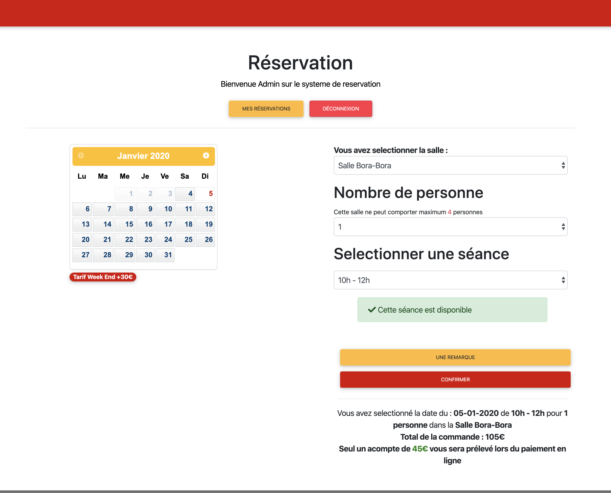

# RESAVO
- Follow @ActuSenzo -- #CodeWithLove #Resavo 

## PRÉSENTATION

RESAVO est un projet open source. L'idée est de créer un système de réservation "clef en main", en y apportant des fonctionnalitées avec les dernières technologies. 
Nous essayerons de répondre à un large éventaille de cas d'usage possible. Nous essayerons de créer un UI & UX avancée. 
J'ai fais le choix de créer les ISSUES en français pour faciliter la compréhension aux developpeurs débutants. 
Nous essayerons de rendre ce projet le plus générique possible et personnalisable ( du choix de la couleur du thème, au choix entre Paypal ou Stripe... )

Le projet sous ça forme actuel avait été fait avec une personnalisation spécifique. Vous trouverez surment du code à jeter/mofidier.
Le but étant de partir de cette base, pour créer un projet générique et solide, avec de bonnes pratiques.



## COMMENT CONTRIBUER ?

Rendez vous dans l'onglet "ISSUE". Comme vous l'aurez compris, c'est ici qu'on liste les tâches à effectuer.
Une fois que vous avez repéré une ISSUE, assignez vous l'ISSUE, et vous commencerez par créer votre branche portant le nom de ISSUE.

Exemple : ``git checkout -b ISSUE-#22``

Vous effectuerez votre travail dessus. Après avoir commit (en suivant toujours la convention de nommage ```ISSUE-#22 : <la tache réaliser au sens précis>```) 
et push votre travail, vous pouvez passez a l'etape suivante,
qui est d'ouvrir une Pull Request. On imposera une convention en la nommant :

```ISSUE-#22 : <la tache réaliser au sens large >```

Concentrez vous vraiment sur la tâche choisie. Ne mélangez pas une correction que vous auriez envie de faire dans une tâche qui n'a rien à y voir.
Il est souvent facile de s'éparpiller...
Si vous estimez que vous avez fini votre travail, vous pouvez le labelliser en "Prêt pour relecture".
Un/Des contributeurs pourront relire et proposer des corrections/suggestions à apporter à votre travail.
Une fois celui-ci validé par au moins 2 contributeurs, votre travail sera en mesure d'être mergé dans le master.
Vous pourrez ensuite retourner sur votre master en local et effectuer un ```git pull```.

Pensez à supprimer vos "branch" pour ne pas finir avec un nombre incompréhensible de branches.

## INSTALLATION

### Paypal SANDBOX TEST

Créez votre SANDBOX (celle-ci vous permettra d'effectuer des faux paiements et avoir le réel comportement de l'application) :

Cf : https://developer.paypal.com/docs/api/overview/#create-sandbox-accounts

Créez ensuite un fichier ``.env.local`` avec comme variable d'environnement:

```
CLIENT_ID=
CLIENT_SECRET=
```

Après avoir configuré le ``.env.local`` du projet :

```
$ git clone git@github.com:senzowayne/resavo.git
$ cd resavo/
$ composer install
$ php bin/console doctrine:database:create
$ php bin/console doctrine:schema:update -f
$ php bin/console doctrine:fixtures:load
$ php bin/console server:run
```
Lien : http://127.0.0.1:8000/

Vous devriez à present voir la page d'accueil du projet, avec la possibilité de vous inscrire et de vous connecter.
Le chargement des fixtures nous aura créé quelques élèments pour commencer.

Vous pouvez dès à présent vous connecter avec un compte admin:


Identifiant : admin@resavo.fr

mdp: password

## Technologie

* Symfony 4.4
* Twig
* Javascript
* Jquery
* Bootstrap

## Credit
Merci à @Marlene78 pour la typo et félicitations pour sa première contrib.

Merci @Yanoucrea pour ces bonnes pratiques de conventions ;) 
